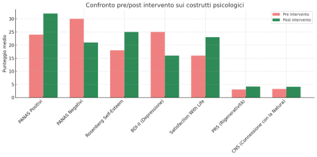

RELAZIONE DEL PROGETTO PER IL LABORATORIO DI AMBIENTE NATURALE E BENESSERE PSICOFISICO

**DEFINIZIONE DEL PROBLEMA**

Il contesto penitenziario italiano è segnato da condizioni ambientali e psicosociali critiche, che ostacolano i percorsi di benessere e reinserimento. Le carceri soffrono di un grave sovraffollamento: nel 2024, il tasso medio di affollamento ha superato il 130%. A ciò si aggiunge un elevato tasso di recidiva: circa il 68,7% dei detenuti torna a delinquere dopo la scarcerazione.

L’ambiente carcerario limita fortemente l’accesso a stimoli sensoriali, relazioni significative e opportunità di azione autonoma. La letteratura della Psicologia Ambientale (Kaplan & Kaplan, 1989; Ulrich, 1983) evidenzia come gli ambienti naturali possano svolgere una funzione rigenerativa, riducendo lo stress, migliorando l’umore e sostenendo le capacità cognitive e attentive. Questi benefici sono rafforzati da studi recenti che mostrano come il contatto con la natura favorisca l’emergere dell’agency, rafforzi il senso di connessione ambientale e stimoli nuove narrazioni identitarie (Pasini et al., 2009; Mayer & Frantz, 2004).

L’ortoterapia, già presente in alcune esperienze italiane e internazionali, si configura come un intervento integrato che combina dimensione ecologica, relazionale e formativa. Attraverso la cura di ambienti verdi interni al carcere, i detenuti possono sperimentare attività sensate e autodeterminate, capaci di rafforzare l’autoefficacia, il senso di responsabilità e la proiezione verso il futuro. Lavorare con la natura offre anche uno spazio simbolico e concreto per ricostruire la relazione con la comunità, in una prospettiva di giustizia riparativa.

Il progetto si colloca in questa cornice teorica e operativa, proponendo un modello innovativo e replicabile di ortoterapia rigenerativa nel sistema penitenziario italiano. Un ulteriore elemento critico riguarda l’uso estensivo di psicofarmaci: secondo il Rapporto Antigone, nel 2022 la spesa per psicofarmaci nelle carceri italiane ha superato i due milioni di euro, spesso in assenza di un adeguato supporto terapeutico. L’ortoterapia, promuovendo il benessere psicologico e le competenze di autoregolazione, può contribuire a ridurre la dipendenza da trattamenti farmacologici non sempre appropriati. Uno studio condotto in un carcere sudcoreano (Lee et al., 2021) ha mostrato che un ciclo di 12 sessioni settimanali di ortoterapia ha determinato una significativa riduzione dei livelli di depressione e un incremento dell’autostima e della soddisfazione di vita nei detenuti partecipanti.

**Target specifico**
Il progetto si rivolge a persone detenute negli istituti penitenziari italiani, con particolare attenzione a coloro che:

- partecipano o sono candidabili a programmi di lavoro esterno (es. art. 21 OP), in un’ottica di reinserimento progressivo;
- presentano segnali di disagio psichico (es. sintomi depressivi, ansiosi, da stress prolungato);
- manifestano interesse per percorsi ecologici, esperienziali e responsabilizzanti;

**Obiettivo generale**
Promuovere il benessere psicologico e la riabilitazione sociale delle persone detenute attraverso attività orticole e ambientali, generando potenziali effetti a cascata: miglioramento delle condizioni carcerarie, diffusione di pratiche sostenibili, sensibilizzazione della cittadinanza.

**Obiettivi specifici**

- Ridurre lo stress psicofisiologico e migliorare l’umore, tramite contatto continuativo con la natura e ambienti rigenerativi.
- Favorire una gestione più autonoma e consapevole della quotidianità, anche tramite la riduzione dell’uso di psicofarmaci.
- Promuovere l’agency, il senso di responsabilità e la cooperazione sociale, attraverso attività narrativo-riflessive come il diario ecologico.
- Sviluppare competenze pratiche trasferibili (es. orticoltura, compostaggio, cura del verde), utili per il reinserimento lavorativo.

**Domanda di ricerca**
*In che modo un intervento di orticoltura rigenerativa in ambito carcerario può influenzare il benessere psicologico, le funzioni cognitive e il senso di cambiamento identitario delle persone detenute?*

**Attività principali**

- **Cura delle piante**: attività manuali (piantumazione, irrigazione, potatura) che promuovono senso di responsabilità e regolazione emotiva.
- **Gestione dell’orto**: semina, raccolta, manutenzione. Attività concrete e gratificanti che stimolano cooperazione e apprendimento.
- **Compostaggio**: trasformazione dei rifiuti organici in fertilizzante, promuovendo consapevolezza ecologica e sostenibilità.
- **Costruzione di strutture verdi**: realizzazione di piccoli arredi ecologici (panchine, serre, orti verticali) che abbelliscono e migliorano gli spazi verdi.

**Modalità di svolgimento**

- Due sessioni settimanali da 2 ore, in piccoli gruppi, per 6 mesi.
- Attività a rotazione tra i gruppi.
- Utilizzo e riqualificazione degli spazi verdi esistenti nel carcere.

**Prototipo di programma (sintesi per mese)**

|**Mese**|**Attività**|**Luogo**|**Dettagli**|
| :-: | :-: | :-: | :-: |
|1|Introduzione e formazione|Aula + Orti|Formazione ecologica e organizzazione dei gruppi di lavoro.|
|1-2|Avvio cura piante e orti|Orti + Giardini|Prime pratiche orticole e avvio del compostaggio.|
|3-4|Gestione avanzata di orti e compostaggio|Orti + Compostaggio|Approfondimento tecnico, raccolta e gestione rifiuti organici.|
|5-6|Costruzione strutture verdi e manutenzione|Orti + Cortili|Realizzazione arredi ecologici e riqualificazione spazi verdi.|
|6|Riflessione e diario ecologico|Orti + Aula|Condivisione esperienze, diario ecologico, valutazione finale.|

**Figure coinvolte**

- **Educatore ambientale / formatore**: facilita la partecipazione, promuove la cooperazione, cura il clima relazionale.
- **Agronomo / tecnico agricolo**: supervisiona le fasi operative, garantisce qualità e sostenibilità del lavoro.
- **Psicologo ambientale**: guida i momenti riflessivi e l’uso del diario ecologico, promuovendo consapevolezza e benessere.
- **Personale educativo e di sicurezza penitenziaria**: garantisce la regolarità, la sicurezza e la continuità delle attività.

**Collaborazioni**

- **Direzione dell’istituto penitenziario**: coordinamento interno e supervisione.
- **UEPE**: integrazione educativa e valutazione d’impatto.
- **Cooperative sociali e associazioni**: progettazione, formazione tecnica, consulenza e supporto operativo.

**FONTI DI FINANZIAMENTO**

- **Bando regionale “Linea 2 – Cassa delle Ammende” (DGR n. 1405/2022, CUP H11J22000410001)**: quadro di riferimento prioritario.
- **Cooperative sociali**: risorse, expertise e cofinanziamento tramite bandi pubblici o fondi europei.
- **Crowdfunding e donazioni private**: coinvolgimento civico, supporto materiale (es. attrezzi, semi, arredi).

**STRUMENTI DI VALUTAZIONE**

**Indicatori quantitativi**

- **PANAS (Positive and Negative Affect Schedule)**: valutazione degli stati emotivi.
- **Rosenberg Self-Esteem Scale, SWLS, BDI-II**: autostima, soddisfazione di vita e sintomi depressivi.
- **PRS/IT (Perceived Restorativeness Scale)**: percezione degli ambienti rigenerativi.
- **CNS (Connectedness to Nature Scale)**: connessione affettiva con la natura.

**Indicatori qualitativi e comportamentali**

- **Diario ecologico**: narrazione dell’esperienza e tracce di trasformazione identitaria.
- **Osservazioni strutturate**: indicatori di agency, responsabilità, collaborazione.
- **Griglie di valutazione e autovalutazione**: costanza, iniziativa, competenze pratiche.

**Modalità di somministrazione**
Tutti gli strumenti saranno somministrati in forma cartacea da operatori formati, in modalità pre-post (e, dove previsto, anche con cadenza mensile). I dati saranno raccolti in forma anonima e su base volontaria.

**RISULTATI ATTESI** 

I seguenti risultati rappresentano delle ipotetiche correlazioni tra le variabili che abbiamo deciso di osservare. Esse si basano su calcoli stimati dall’intelligenza artificiale, a cui “abbiamo chiesto” di mettere in relazione dei dati estratti da meta-analisi riguardanti gli effetti benefici dell’ortoterapia sui costrutti indagati e gli obiettivi che ci siamo prefissati. Queste stime fungeranno da leva per proporre il progetto in altri istituti penitenziari e attrarre ulteriori finanziamenti pubblici o privati.

